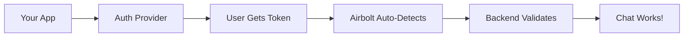

# Authentication in Airbolt

This guide helps you choose and configure an authentication provider for your Airbolt integration. Airbolt supports multiple auth providers with zero-configuration development and secure production validation.

## 🚀 Quick Start

**For Development**: No configuration needed! Just add authentication to your app and use Airbolt - it automatically detects and validates tokens from most providers.

**For Production**: Set a few environment variables to restrict token acceptance to your specific provider configuration.

## Provider Decision Guide

Choose the authentication provider that best fits your needs:

| Provider                            | Best For                          | Key Benefits                                      | Setup Complexity |
| ----------------------------------- | --------------------------------- | ------------------------------------------------- | ---------------- |
| **[Clerk](./clerk-setup.md)**       | New projects, rapid development   | Zero-config, great UX, comprehensive features     | ⭐ Easy          |
| **[Auth0](./auth0-setup.md)**       | Enterprise, existing SSO          | Industry standard, extensive integrations         | ⭐⭐ Moderate    |
| **[Supabase](./supabase-setup.md)** | Full-stack apps, PostgreSQL users | Backend + auth in one, great developer experience | ⭐ Easy          |
| **[Firebase](./firebase-setup.md)** | Google ecosystem, mobile apps     | Google integration, real-time features            | ⭐⭐ Moderate    |

## How Authentication Works in Airbolt

### Development Mode (Zero Config)



- **Auto-detection**: Airbolt SDK detects common auth providers automatically
- **Token validation**: Backend validates any legitimate token from recognized providers
- **Zero configuration**: No environment variables or setup required

### Production Mode (Secure)


- **Provider restriction**: Backend only accepts tokens from YOUR configured provider
- **Enhanced security**: Prevents token substitution attacks
- **Audit logging**: Comprehensive logging of all authentication events

## Environment Variables Overview

### Universal Configuration

```bash
# JWT Session Configuration (for Airbolt's internal tokens)
JWT_SECRET=your-cryptographically-secure-secret  # Generate with: openssl rand -base64 64
JWT_EXPIRES_IN=10m                              # Session token expiry (default: 10 minutes)
JWT_ALGORITHM=HS256                             # Signing algorithm (HS256 or RS256)

# Authentication Mode
AUTH_REQUIRED=true                              # Enable auth in development (optional)
VALIDATE_JWT=true                               # Enable JWT validation (default: true)

# Rate Limiting
AUTH_RATE_LIMIT_MAX=10                          # Max auth requests per window (default: 10)
AUTH_RATE_LIMIT_WINDOW_MS=900000                # Window in ms (default: 15 minutes)
```

### Provider-Specific Variables

**Clerk**:

```bash
CLERK_PUBLISHABLE_KEY=pk_test_...
CLERK_SECRET_KEY=sk_test_...
CLERK_AUTHORIZED_PARTIES=localhost:3000,myapp.com  # Optional: restrict audiences
```

**Auth0**:

```bash
AUTH0_DOMAIN=your-tenant.auth0.com
AUTH0_AUDIENCE=https://your-api-identifier        # Optional but recommended
AUTH0_ISSUER=https://your-tenant.auth0.com/       # Optional: computed from domain
```

**Supabase**:

```bash
SUPABASE_URL=https://your-project.supabase.co
SUPABASE_JWT_SECRET=your-jwt-secret-key           # From Supabase dashboard
```

**Firebase**:

```bash
FIREBASE_PROJECT_ID=your-firebase-project-id
```

**Custom OIDC**:

```bash
EXTERNAL_JWT_ISSUER=https://your-oidc-provider.com
EXTERNAL_JWT_JWKS_URI=https://provider.com/.well-known/jwks.json  # Optional
EXTERNAL_JWT_AUDIENCE=your-audience                                # Optional
EXTERNAL_JWT_PUBLIC_KEY=-----BEGIN CERTIFICATE-----...            # Optional
EXTERNAL_JWT_SECRET=your-hmac-secret                              # Optional for HS256
```

## Security Features

### Automatic JWT Verification

- **Cryptographic validation**: Full signature verification using `jose` library
- **Claims validation**: Expiration, issuer, and audience checks
- **Key management**: Automatic JWKS fetching and caching (24-hour cache)
- **Algorithm safety**: Prevents algorithm confusion attacks

### Rate Limiting

- **Per-user limits**: 10 requests per 15 minutes per IP+User combination
- **Memory efficient**: Automatic cleanup of expired entries
- **Development bypass**: Disabled in development mode for easier testing

### Audit Logging

- **Comprehensive events**: All authentication attempts, successes, and failures
- **Structured logging**: JSON format with correlation IDs
- **Privacy protection**: User data sanitized (emails show domain only)
- **Security monitoring**: Rate limit violations and suspicious patterns

### Single-Flight Coalescing

- **Performance**: Prevents duplicate verification of identical tokens
- **Privacy**: Token-based keys are hashed to protect token content
- **Memory safety**: Automatic cleanup after verification completion

## Testing Your Setup

### 1. Verify Environment Variables

```bash
# Check your configuration
curl -X POST http://localhost:3000/api/auth/exchange \
  -H "Content-Type: application/json" \
  -d '{"providerToken": "your-token-here"}'
```

### 2. Test Token Exchange

```javascript
// Frontend test (replace with your provider's token)
const response = await fetch('/api/auth/exchange', {
  method: 'POST',
  headers: {
    'Content-Type': 'application/json',
  },
  body: JSON.stringify({
    providerToken: yourProviderToken,
  }),
});

const { sessionToken } = await response.json();
console.log('Session token received:', !!sessionToken);
```

### 3. Test Chat API

```bash
# Test with session token
curl -X POST http://localhost:3000/api/chat \
  -H "Authorization: Bearer YOUR_SESSION_TOKEN" \
  -H "Content-Type: application/json" \
  -d '{"message": "Hello, authenticated world!"}'
```

## Common Issues and Solutions

### "No auth provider detected"

- **Cause**: No authentication provider configuration found
- **Solution**: Set up at least one provider's environment variables
- **Dev Mode**: This is expected - authentication works without configuration

### "Token signature verification failed"

- **Cause**: Invalid token signature or wrong signing key
- **Solution**:
  1. Verify provider configuration matches token issuer
  2. Check JWKS endpoint accessibility
  3. Ensure provider hasn't rotated signing keys

### "Rate limit exceeded"

- **Cause**: Too many authentication requests from same IP+User
- **Solution**:
  1. Implement token caching on client side
  2. Check rate limit configuration
  3. Consider increasing limits for high-traffic apps

### "Token has expired"

- **Cause**: Token `exp` claim is in the past
- **Solution**:
  1. Refresh the token through your auth provider
  2. Check client/server clock synchronization
  3. Ensure token refresh logic is working

## Production Checklist

### Before Deployment

- [ ] **Provider configured**: Environment variables set for your chosen provider
- [ ] **JWT_SECRET generated**: Use `openssl rand -base64 64`
- [ ] **Rate limiting configured**: Adjust limits for your expected traffic
- [ ] **HTTPS enforced**: Configure TLS termination
- [ ] **Security headers enabled**: Built-in headers middleware active
- [ ] **Audit logging configured**: Log destination and retention policy set

### After Deployment

- [ ] **Monitor authentication events**: Check for unusual patterns
- [ ] **Test token refresh**: Ensure tokens refresh properly before expiry
- [ ] **Verify rate limiting**: Confirm limits work as expected
- [ ] **Check audit logs**: Authentication events properly logged
- [ ] **Test failover**: Ensure graceful handling of auth provider outages

## Architecture Details

### Token Flow

1. **User authenticates** with your chosen provider (Clerk, Auth0, etc.)
2. **Frontend receives** provider-specific JWT token
3. **Airbolt SDK automatically** detects provider and retrieves token
4. **Token exchange** happens via `/api/auth/exchange` endpoint
5. **Backend validates** token against provider's public keys
6. **Session token** returned for subsequent API calls
7. **Chat requests** use session token in Authorization header

### Security Layers

1. **Transport security**: HTTPS enforced in production
2. **Token validation**: Cryptographic signature verification
3. **Claims validation**: Expiration, issuer, audience checks
4. **Rate limiting**: Per-user request throttling
5. **Audit logging**: Comprehensive event tracking
6. **Security headers**: CSP, HSTS, and other protective headers

## Next Steps

1. **Choose your provider**: Review the setup guides linked above
2. **Follow the setup guide**: Complete configuration for your chosen provider
3. **Test locally**: Use development mode to verify integration
4. **Configure for production**: Set environment variables for security
5. **Deploy and monitor**: Use audit logs to monitor authentication health

## Additional Resources

- [JWT Security Best Practices](https://datatracker.ietf.org/doc/html/rfc8725)
- [OWASP Authentication Cheat Sheet](https://cheatsheetseries.owasp.org/cheatsheets/Authentication_Cheat_Sheet.html)
- [Airbolt Security Guide](../../SECURITY.md)
- [Production Deployment Guide](../../PRODUCTION.md)

## Support

- **Documentation Issues**: [Open an issue](https://github.com/your-repo/issues)
- **Integration Help**: Check the example apps in `/examples/`
- **Security Concerns**: See [Security Policy](../../SECURITY.md)
