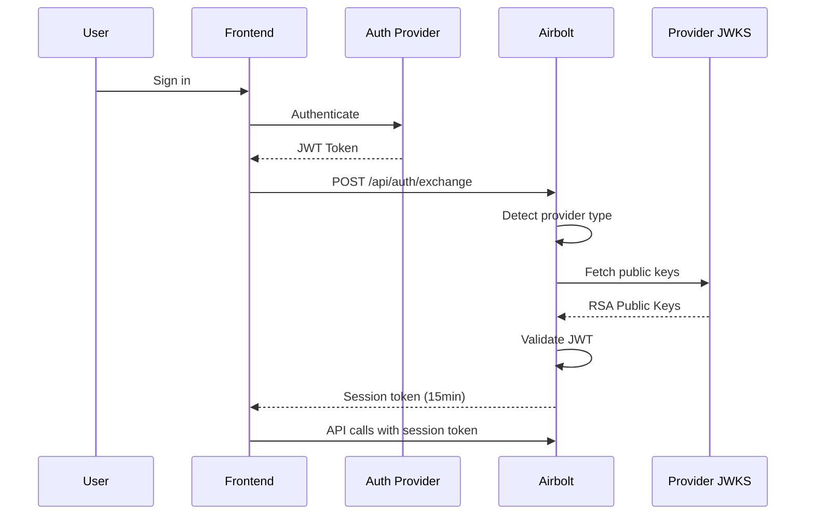

# Authentication

Airbolt provides enterprise-grade authentication with zero configuration required. Just use your existing auth provider - we handle the rest.

## Quick Start

```typescript
// Your existing auth (Clerk, Auth0, Firebase, Supabase)
const token = await getTokenFromYourAuthProvider();

// That's it - Airbolt auto-detects and validates
const response = await fetch('https://api.airbolt.dev/api/auth/exchange', {
  method: 'POST',
  body: JSON.stringify({ token }),
});
```

## Supported Providers

### Zero-Config Providers

These providers work automatically without any backend configuration:

| Provider     | Detection | Issuer Pattern                                    |
| ------------ | --------- | ------------------------------------------------- |
| **Clerk**    | Automatic | `*.clerk.accounts.dev`, `*.clerk.com`             |
| **Auth0**    | Automatic | `*.auth0.com`, `*.us.auth0.com`, `*.eu.auth0.com` |
| **Firebase** | Automatic | `securetoken.google.com/*`                        |
| **Supabase** | Automatic | `*.supabase.co`, `*.supabase.io`                  |

### Custom Providers

Any OIDC-compliant provider works with minimal configuration:

```bash
# Just set your issuer URL
EXTERNAL_JWT_ISSUER=https://your-provider.com
EXTERNAL_JWT_AUDIENCE=your-audience  # Optional
```

## How It Works

### 1. Token Exchange Flow



### 2. Auto-Discovery Process

1. **Token Inspection**: Airbolt decodes the JWT to identify the issuer
2. **Provider Detection**: Matches issuer against known patterns
3. **OIDC Discovery**: Fetches `.well-known/openid-configuration`
4. **JWKS Retrieval**: Gets public keys from `jwks_uri`
5. **Validation**: Verifies signature, expiry, and claims
6. **Session Creation**: Issues short-lived Airbolt session token

### 3. Security Architecture

#### Token Validation

Every external token undergoes comprehensive validation:

- **Signature Verification**: RSA/ECDSA signature using provider's public key
- **Expiry Check**: Ensures token hasn't expired
- **Not Before Check**: Validates token is active
- **Issuer Validation**: Confirms trusted issuer
- **Audience Validation**: Verifies intended recipient (if configured)

#### JWKS Caching

- Public keys cached for 5 minutes
- Automatic refresh on cache miss
- Reduces latency and provider load

#### Session Tokens

- 15-minute expiry for security
- Contains user identity and metadata
- Stateless JWT for horizontal scaling

## Configuration Options

### Development Mode

```bash
# No configuration needed - auto-discovery handles everything
NODE_ENV=development
```

In development, the `/api/auth/exchange` endpoint accepts empty requests for testing:

```bash
curl -X POST http://localhost:3000/api/auth/exchange
# Returns: dev-user session token
```

### Production Mode

#### Option 1: Zero-Config (Recommended)

```bash
NODE_ENV=production
# That's it - auto-discovery handles known providers
```

#### Option 2: Explicit Provider

```bash
NODE_ENV=production
EXTERNAL_JWT_ISSUER=https://your-domain.clerk.accounts.dev
EXTERNAL_JWT_AUDIENCE=your-api  # Optional audience validation
```

### Internal JWT Mode

For testing or custom auth flows:

```bash
# Don't set EXTERNAL_JWT_ISSUER
# Use /api/tokens endpoint for token generation
```

## SDK Integration

### React SDK

The SDK automatically detects your auth provider:

```tsx
import { ChatWidget } from '@airbolt/react';

// Clerk example - SDK auto-detects
function App() {
  return <ChatWidget baseURL="https://api.airbolt.dev" />;
}
```

### Vanilla JavaScript

```javascript
import { AirboltChat } from '@airbolt/sdk';

const chat = new AirboltChat({
  baseURL: 'https://api.airbolt.dev',
  // SDK automatically finds and uses your auth provider
});
```

### Provider Detection Order

The SDK checks for providers in this sequence:

1. Clerk (window.Clerk)
2. Supabase (window.supabase)
3. Auth0 (window.auth0)
4. Firebase (window.firebase)

## API Reference

### POST /api/auth/exchange

Exchange external JWT for session token.

#### Request

```typescript
{
  token?: string  // Required in production, optional in development
}
```

#### Response

```typescript
{
  sessionToken: string; // Internal JWT (15min expiry)
  expiresIn: '15m'; // Expiry duration
  tokenType: 'Bearer'; // Token type for Authorization header
}
```

#### Error Responses

```typescript
// 401 - Invalid/expired token
{
  error: 'Unauthorized';
  message: 'Invalid token: Token expired';
  statusCode: 401;
}

// 400 - Missing required token
{
  error: 'BadRequest';
  message: 'Token is required for authentication';
  statusCode: 400;
}
```

### Using Session Tokens

Include the session token in API requests:

```typescript
fetch('https://api.airbolt.dev/api/chat', {
  headers: {
    Authorization: `Bearer ${sessionToken}`,
    'Content-Type': 'application/json',
  },
  method: 'POST',
  body: JSON.stringify({
    messages: [{ role: 'user', content: 'Hello' }],
  }),
});
```

## Best Practices

### Frontend

1. **Token Refresh**: Request new session tokens before expiry
2. **Error Handling**: Gracefully handle 401 responses
3. **Secure Storage**: Use memory or secure storage for tokens

### Backend

1. **Production Config**: Always set `NODE_ENV=production`
2. **Audience Claims**: Configure `EXTERNAL_JWT_AUDIENCE` for additional security
3. **Rate Limiting**: Configure appropriate limits for your use case

### Security

1. **HTTPS Only**: Always use HTTPS in production
2. **Token Expiry**: Keep session tokens short-lived (15 minutes)
3. **Audit Logging**: Monitor authentication attempts
4. **CORS Configuration**: Restrict `ALLOWED_ORIGIN` to your domains

## Troubleshooting

### Common Issues

#### "Token is required for authentication"

- **Cause**: Missing token in production mode
- **Fix**: Ensure your frontend sends the JWT token

#### "Invalid token: Token expired"

- **Cause**: External JWT has expired
- **Fix**: Refresh token from your auth provider

#### "No validator available for token"

- **Cause**: Unknown token issuer
- **Fix**: Configure `EXTERNAL_JWT_ISSUER` explicitly

#### "JWKS fetch failed"

- **Cause**: Cannot reach provider's JWKS endpoint
- **Fix**: Check network connectivity and issuer URL

### Debug Mode

Enable detailed logging:

```bash
LOG_LEVEL=debug
```

Logs will show:

- Token detection process
- Provider identification
- JWKS fetching
- Validation steps
- Session token generation

## Examples

### Clerk Integration

```tsx
// Frontend (React)
import { useAuth } from '@clerk/clerk-react';
import { ChatWidget } from '@airbolt/react';

function App() {
  const { isSignedIn } = useAuth();

  return isSignedIn ? (
    <ChatWidget baseURL="https://api.airbolt.dev" />
  ) : (
    <SignIn />
  );
}
```

### Auth0 Integration

```typescript
// Frontend (Vanilla JS)
const token = await auth0.getAccessTokenSilently();

const response = await fetch('https://api.airbolt.dev/api/auth/exchange', {
  method: 'POST',
  headers: { 'Content-Type': 'application/json' },
  body: JSON.stringify({ token }),
});

const { sessionToken } = await response.json();
```

### Firebase Integration

```typescript
// Frontend
const user = firebase.auth().currentUser;
const token = await user.getIdToken();

// Exchange for session token
const { sessionToken } = await exchangeToken(token);
```

### Supabase Integration

```typescript
// Frontend
const {
  data: { session },
} = await supabase.auth.getSession();
const token = session?.access_token;

// Exchange for session token
const { sessionToken } = await exchangeToken(token);
```
